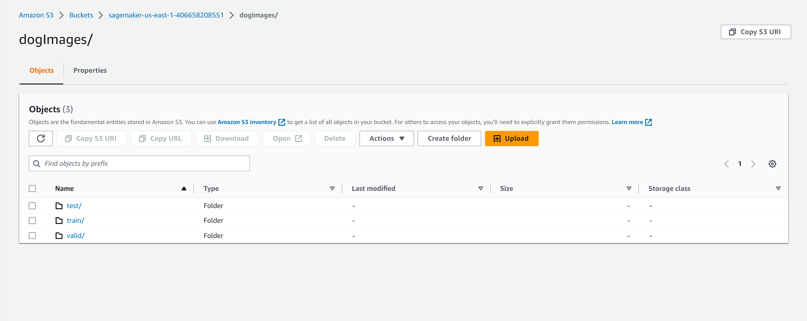
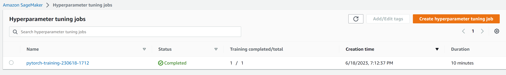
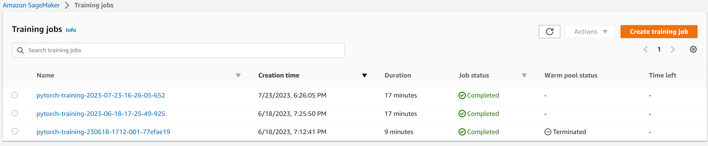
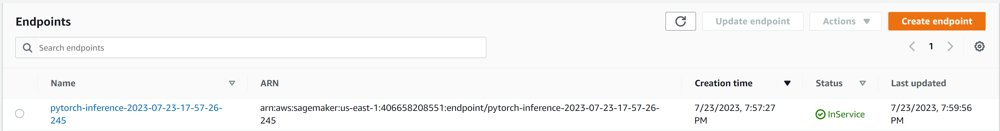

# Image Classification using AWS SageMaker

Use AWS Sagemaker to train a pretrained model that can perform image classification by using the Sagemaker profiling, debugger, hyperparameter tuning and other good ML engineering practices. This can be done on either the provided dog breed classication data set or one of your choice.

## Project Set Up and Installation
Enter AWS through the gateway in the course and open SageMaker Studio. 
Download the starter files.
Download/Make the dataset available. 

## Dataset
The provided dataset is the dogbreed classification dataset which can be found in the classroom.
The project is designed to be dataset independent so if there is a dataset that is more interesting or relevant to your work, you are welcome to use it to complete the project.

### Access
Upload the data to an S3 bucket through the AWS Gateway so that SageMaker has access to the data. 

## Hyperparameter Tuning
For this experiment, I chose to use a pre-trained Resnet50 model for the dog breed classification task. Resnet50 is a convolutional neural network (CNN) architecture that has proven to be highly effective for image classification tasks. It has 50 layers and utilizes residual blocks to address the vanishing gradient problem, making it easier to train deeper networks. Additionally, Resnet50 has been trained on a large dataset (ImageNet) and has learned useful features that can be leveraged for transfer learning in our specific dog breed classification task.

The hyperparameter search aims to find the optimal set of hyperparameters that can yield the best performance for our model.

Best hyperparameter: 
 - batch_size: 32
 - epoch: 5
 - lr: 0.0013928563495246822

## Debugging and Profiling
The profiling summary of the Debugger built-in rules provides valuable insights into the training job's behavior and performance. During the training job, several rules were triggered, and the LowGPUUtilization rule was the most frequently triggered. This rule checks for low or fluctuating GPU utilization, which may indicate bottlenecks, blocking calls for synchronizations, or a small batch size. To address this issue, one can check for bottlenecks, minimize blocking calls, change the distributed training strategy, or increase the batch size.

Another rule that triggered frequently is the BatchSize rule, which detects underutilized GPUs due to a small batch size. The recommendation to address this issue is to either run on a smaller instance type or increase the batch size.

The StepOutlier rule detected outliers in step duration, indicating potential system stall or bottleneck issues. To resolve this, one should investigate any bottlenecks (CPU, I/O) that might be correlated with the step outliers.

The Dataloader rule checks the number of data loaders running in parallel and compares it to the number of available CPU cores. It recommends changing the number of data loader processes if the count is significantly smaller or larger than the available cores to optimize GPU utilization.

The CPUBottleneck rule highlights high CPU utilization and low GPU utilization, which may indicate CPU bottlenecks. The recommendation is to increase the number of data loaders or apply data pre-fetching to address this issue.

The IOBottleneck rule checks for high data I/O wait time and low GPU utilization, indicating potential I/O bottlenecks. To resolve this, pre-fetching data or using different file formats with improved I/O performance is suggested.

The LoadBalancing rule detects workload balancing issues across GPUs, where one GPU might be overused compared to others in data parallelism. To improve data parallelization efficiency, one can choose a different distributed training strategy or framework.

The GPUMemoryIncrease rule measures the average GPU memory footprint and triggers if there is a large increase. To accommodate larger memory requirements, using a larger instance type with more memory is recommended.

The MaxInitializationTime rule checks if the initialization time exceeds a threshold percent of the total training time. To reduce initialization time when using File mode, switching to Pipe mode (in case of TensorFlow framework) is suggested.

The training loop analysis provided statistics on step durations, and one outlier was detected with a larger duration than three times the standard deviation. Further investigation into this outlier may help identify potential performance issues.

### Results

Overall, the Debugger built-in rules and their recommendations offer valuable guidance to optimize the training job's performance and address any potential bottlenecks or inefficiencies in the model training process.

## Model Deployment

To call the deployed endpoint without showing the actual code, you would typically use an HTTP POST request to the endpoint's URL. The URL of the endpoint is provided when you deploy the model using Amazon SageMaker.

Here's a concise explanation of how to call the endpoint:

Deploy the Model: Deploy the trained model using Amazon SageMaker's PyTorch model deployment functionality. This will create an endpoint with a unique URL.

Prepare the Input: Prepare the input data (e.g., image) that you want to send for prediction. Make sure the input data is in the expected format (e.g., JSON, image bytes).

Make an HTTP POST Request: Use an HTTP client or library (e.g., requests in Python) to make a POST request to the endpoint's URL, passing the prepared input data in the request body.

Receive and Process the Response: The deployed model will process the input data and return the prediction results. Receive the response from the endpoint and process it to obtain the predicted output (e.g., predicted dog breed).

Handle Errors: Handle any potential errors or exceptions that may occur during the API call, such as connection issues or invalid input data.

Stop the Endpoint (Optional): After you have finished using the endpoint, stop it to avoid incurring unnecessary costs.

## Standout Suggestions
### Pending tasks for the future

1. Implement Data Augmentation: Data augmentation techniques like rotation, flipping, and scaling can help improve model generalization and performance by increasing the diversity of training data.

2. Ensemble Models: Create an ensemble of multiple models with different architectures or hyperparameters to combine their predictions and potentially improve overall accuracy.

3. Fine-Tune Hyperparameters: Conduct a more extensive hyperparameter search to fine-tune the model's performance further.

4. Post-Processing: Implement post-processing techniques to improve the quality of predictions, such as applying thresholding or filtering to remove false positives.