# Operationalizing an AWS ML Project


<div align="center">
    
</div>


In this project, you'll start with a completed ML project. The completed project contains code that trains and deploys an image classification model on AWS Sagemaker. Your goal in this project will be to use several important tools and features of AWS to adjust, improve, configure, and prepare the model you started with for production-grade deployment. Taking raw ML code and preparing it for production deployment is a common task for ML engineers.

## Project Summary
In this project, you will complete the following steps: 
- Train and deploy a model on Sagemaker, using the most appropriate instances. Set up multi-instance training in your Sagemaker notebook.
- Adjust your Sagemaker notebooks to perform training and deployment on EC2.
- Set up a Lambda function for your deployed model. Set up auto-scaling for your deployed endpoint as well as concurrency for your Lambda function.
- Ensure that the security on your ML pipeline is set up properly.

## Step 1: training and deployment on SageMaker
I chose the ml.t3.medium instance in SageMaker for my notebook because it provides sufficient capacity and an optimal balance between CPU and memory resources. When working on machine learning and data analysis tasks, I require efficient performance. Additionally, this instance integrates perfectly with the default kernel of the Data Science 3.0 environment in SageMaker, enhancing productivity and facilitating the development of machine learning models. It also gives me the flexibility to scale up if I need more resources for more complex projects. In summary, this choice ensures a smooth and successful execution of my data science projects.

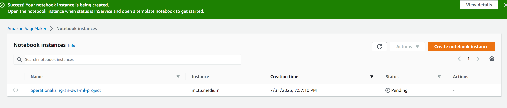
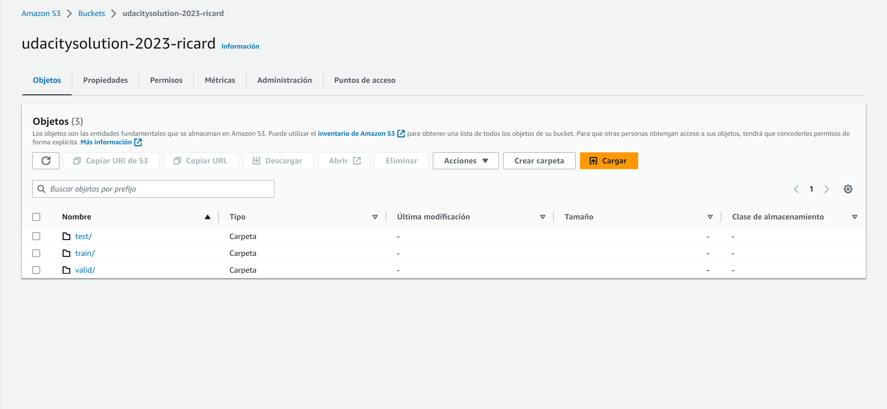
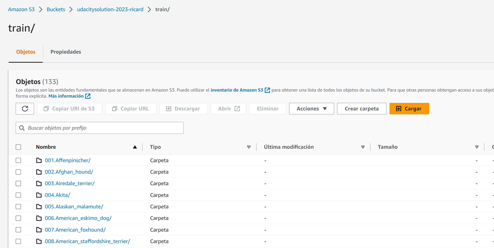


### Step 2: EC2 Training

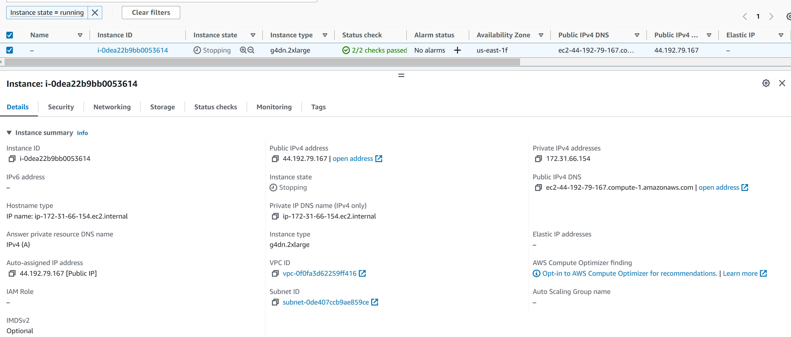

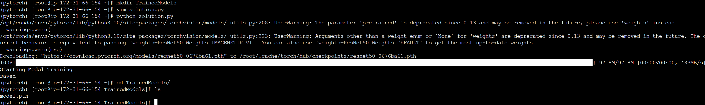

I chose the g4dn.2xlarge instance type for training my dataset of dog images due to its superior GPU capabilities. The g4dn instances are specifically designed to accelerate machine learning workloads, making them ideal for tasks that involve training deep learning models, such as image classification.

Training a dataset of images can be computationally intensive, especially when using convolutional neural networks (CNNs) or other complex architectures. The g4dn.2xlarge instance is equipped with NVIDIA T4 GPUs, which excel at parallel processing and matrix calculations, significantly speeding up the training process for image datasets.

Moreover, the ample memory and vCPU resources of the g4dn.2xlarge instance provide a good balance for handling large datasets and computational tasks associated with deep learning training. This ensures that the model doesn't run into memory bottlenecks or CPU limitations during the training phase.

In summary, I selected the g4dn.2xlarge instance type for its powerful GPU capabilities and sufficient computational resources, making it well-suited for efficiently training my dog image dataset and helping me achieve faster convergence and accurate models for my image classification task.

#### Compares code from Step 1
1. In the first version of the code, there is no main function that controls the flow of execution. Instead, the train() and test() functions are executed directly after defining them. In the second version, a main() function has been added, which takes command-line arguments and orchestrates the training and evaluation process.

2. In the first version, a fixed number of 5 epochs is set for training, and there is no implementation of early stopping based on validation loss. In the second version, early stopping is introduced to prevent overtraining and improve the efficiency of the model.

3. In the second version, logging commands (logger.info()) have been added to display training and validation information, such as loss and accuracy at each epoch. This helps monitor the training progress and obtain relevant information.

4. In the first version, the loss and accuracy in the test() function are calculated using the floor division operator (//), which performs integer division and returns the result as an integer. This may lead to incorrect results when evaluating models that achieve accuracy that is not an integer. In the second version, the division operator (/) is used, which returns the result as a decimal (floating-point number), which is more appropriate for precision calculations.

5. In the first version, there is a commented line of code (#rom torch_snippets import Report) suggesting that a module called Report can be used to log metrics during training. However, this module is not in use in the current code. In the second version, there are no references to the Report module, suggesting that the intention to use it has been removed.


## Step 3: Lambda function setup
The Lambda function is a Python code designed to be invoked as an AWS Lambda function. Its main purpose is to perform inferences using a PyTorch model hosted on a SageMaker endpoint. The function takes input data from the event and sends it to the SageMaker endpoint to obtain results. It then returns an HTTP response with the inference result in JSON format.

```
{
  "statusCode": 200,
  "headers": {
    "Content-Type": "text/plain",
    "Access-Control-Allow-Origin": "*"
  },
  "type-result": "<class 'str'>",
  "COntent-Type-In": "LambdaContext([aws_request_id=d4efb5d0-d1bb-4e13-a109-3d58419eeda6,log_group_name=/aws/lambda/lambdaFunction,log_stream_name=2023/08/05/[$LATEST]9434f04ed8f44efe81f25859b645ce0d,function_name=lambdaFunction,memory_limit_in_mb=128,function_version=$LATEST,invoked_function_arn=arn:aws:lambda:us-east-1:900395491479:function:lambdaFunction,client_context=None,identity=CognitoIdentity([cognito_identity_id=None,cognito_identity_pool_id=None])])",
  "body": "[[0.5043056011199951, -0.11267277598381042, 0.3076387643814087, 0.7362076044082642, 0.8599459528923035, 0.7638752460479736, 0.22371448576450348, 0.6300808787345886, -0.08598820865154266, 0.3987775444984436, 0.7866142988204956, 0.7739871144294739, 0.07782973349094391, 0.7674015760421753, 0.6069070100784302, 0.5892504453659058, -0.1530299335718155, 0.15381494164466858, 0.49854519963264465, 0.5282471776008606, -0.024605026468634605, -0.2369612157344818, 0.4109022915363312, 0.49615833163261414, 0.07285535335540771, -0.29122039675712585, 0.7621810436248779, 0.10342136025428772, 0.691679060459137, 0.2695566415786743, 0.4253123998641968, 0.7095640897750854, -0.22653968632221222, 0.8539465069770813, 0.5050290822982788, -0.4991514980792999, 0.4171290397644043, 0.5104958415031433, 0.06240908056497574, 0.4046955704689026, 0.07212181389331818, 0.23409320414066315, 0.5602418780326843, 0.5592745542526245, 0.48314327001571655, 0.7177528142929077, 0.564630389213562, 0.5135442614555359, 0.2172313630580902, 0.32102832198143005, 0.6827523112297058, 0.5564609169960022, 0.35243743658065796, -0.08627219498157501, 0.14016646146774292, 0.7076066732406616, 0.023776866495609283, 0.5100085735321045, 0.17056676745414734, -0.1663835346698761, 0.48016273975372314, -0.14186467230319977, 0.4297020137310028, 0.18453234434127808, 0.36242401599884033, -0.07418105751276016, 0.1488039791584015, 0.4940333366394043, -0.11109016090631485, 0.3678843080997467, 0.2579999268054962, 0.42860841751098633, 0.3368377685546875, -0.5647169947624207, -0.21378645300865173, 0.6401441097259521, 0.22212083637714386, 0.15492813289165497, 0.5922680497169495, 0.1593337059020996, 0.42584773898124695, 0.5434304475784302, 0.019333714619278908, 0.46084776520729065, -0.026549439877271652, 0.4375596046447754, 0.37730398774147034, 0.2582234740257263, -0.2917434871196747, 0.5749207139015198, 0.604722797870636, 0.19742996990680695, -0.12059875577688217, 0.10853998363018036, 0.2789314389228821, 0.29354506731033325, 0.3771716356277466, -0.16732287406921387, 0.31784141063690186, 0.008785286918282509, 0.3992575705051422, -0.06749582290649414, 0.5952191948890686, 0.11034748703241348, -0.13293389976024628, 0.0776192843914032, 0.40769580006599426, -0.12547984719276428, 0.2328013777732849, -0.03146327659487724, 0.24190334975719452, 0.5323041677474976, -0.20239555835723877, -0.5246328115463257, 0.9048527479171753, -0.18688951432704926, 0.45075640082359314, 0.42421379685401917, -0.3780525326728821, 0.23414066433906555, -0.18067008256912231, -0.1829300969839096, 0.12735502421855927, 0.5483034253120422, -0.10017219930887222, -0.1471933126449585, 0.08831392228603363, -0.1241360455751419, -0.11711524426937103, 0.3643035292625427, -0.39553767442703247, -0.3631000518798828, 0.028591042384505272]]"
}

Function Logs
START RequestId: d4efb5d0-d1bb-4e13-a109-3d58419eeda6 Version: $LATEST
Context::: LambdaContext([aws_request_id=d4efb5d0-d1bb-4e13-a109-3d58419eeda6,log_group_name=/aws/lambda/lambdaFunction,log_stream_name=2023/08/05/[$LATEST]9434f04ed8f44efe81f25859b645ce0d,function_name=lambdaFunction,memory_limit_in_mb=128,function_version=$LATEST,invoked_function_arn=arn:aws:lambda:us-east-1:900395491479:function:lambdaFunction,client_context=None,identity=CognitoIdentity([cognito_identity_id=None,cognito_identity_pool_id=None])])
EventType:: <class 'dict'>
END RequestId: d4efb5d0-d1bb-4e13-a109-3d58419eeda6
REPORT RequestId: d4efb5d0-d1bb-4e13-a109-3d58419eeda6	Duration: 1750.01 ms	Billed Duration: 1751 ms	Memory Size: 128 MB	Max Memory Used: 77 MB

Request ID
d4efb5d0-d1bb-4e13-a109-3d58419eeda6
```

## Step 4: Security and testing

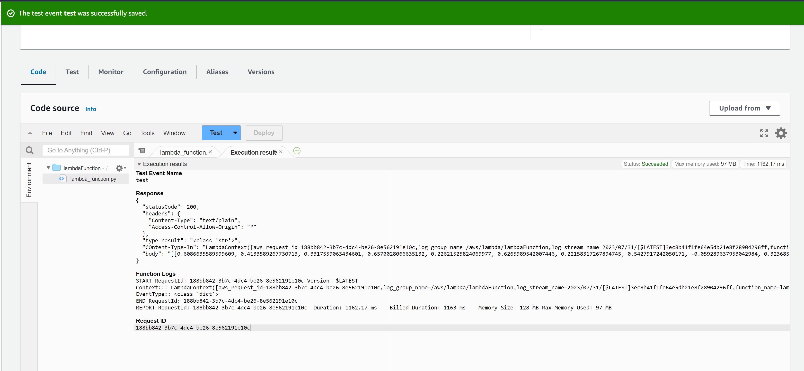
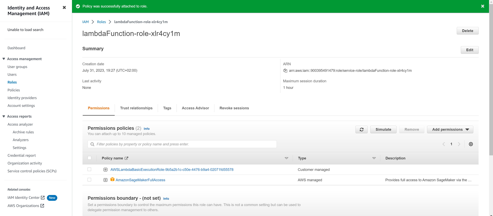
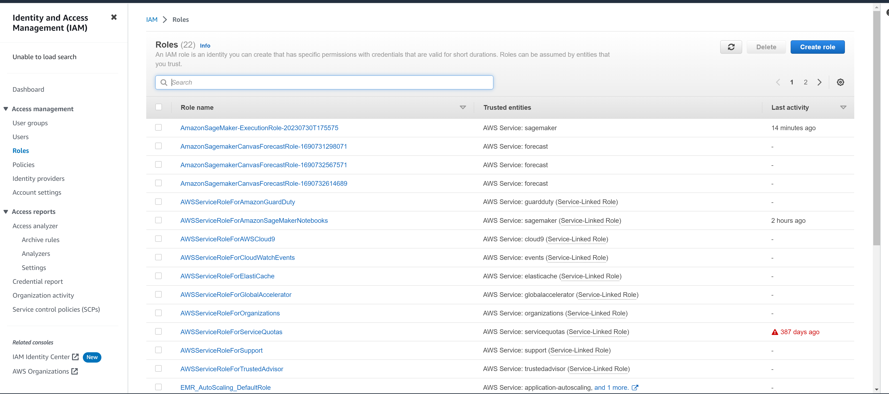

AWS Lambda and IAM (Identity and Access Management) play crucial roles in securing serverless architectures. However, there are certain security considerations and vulnerabilities that organizations need to be aware of to ensure robust protection. One potential insecurity is the misconfiguration of IAM roles and permissions for Lambda functions. Granting excessive permissions to a Lambda function could lead to unintended access to sensitive resources, exposing the entire AWS environment to potential risks. Additionally, improper handling of IAM roles can lead to privilege escalation attacks, where malicious actors gain unauthorized access to resources beyond their intended scope. Organizations must carefully manage IAM roles associated with Lambda functions, adhering to the principle of least privilege to minimize potential damage in case of a security breach. Regular auditing and monitoring of IAM policies are essential to identify and remediate any security gaps, ensuring a more resilient and secure serverless architecture.

## Step 5: Concurrency and auto-scaling

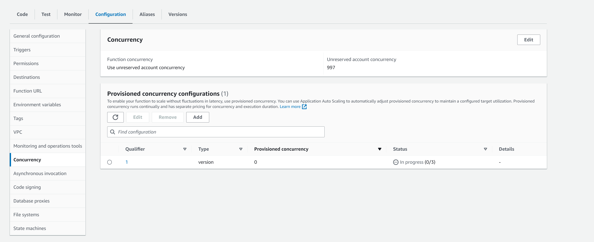
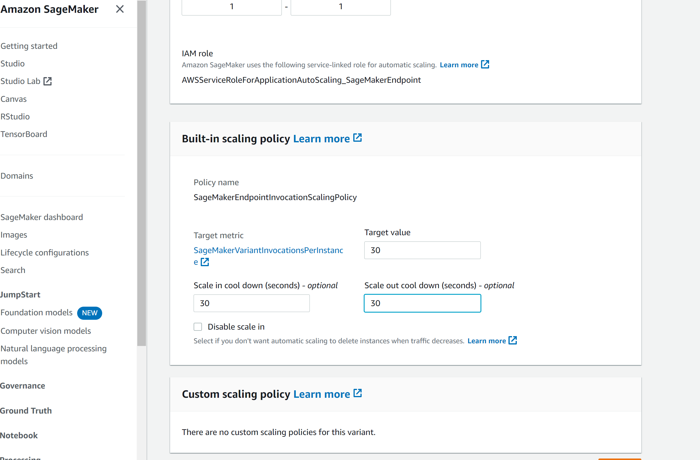
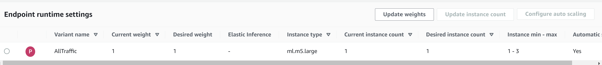

In concurrency, I have created version 0.0.1 and assigned 3 of the available resources. I have decided to set a scaling target of 30 in both directions (up and down) and a cooldown time of 30 seconds due to the dynamic nature of my application and the expected fluctuations in resource demand. With a target value of 30, I am allowing my environment to automatically increase or decrease the number of available resources based on the current system needs.

The 30-second cooldown time provides a balance between responsiveness and scaling stability. If I were to set a shorter cooldown time, the autoscaling could be overly sensitive to temporary fluctuations, leading to excessive scaling up and down of resources. On the other hand, if I were to set a longer cooldown time, the autoscaling might not respond quickly enough to changes in demand, affecting performance and user experience.

By setting these values, I am ensuring that my application has enough capacity to handle traffic spikes while avoiding unnecessary resource wastage during periods of low demand. This configuration gives me the necessary flexibility to adapt to changes in my application's traffic efficiently and effectively, ensuring an optimal experience for my users and maximizing the utilization of available resources.